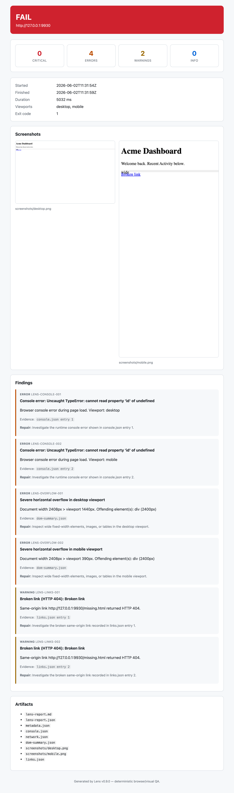
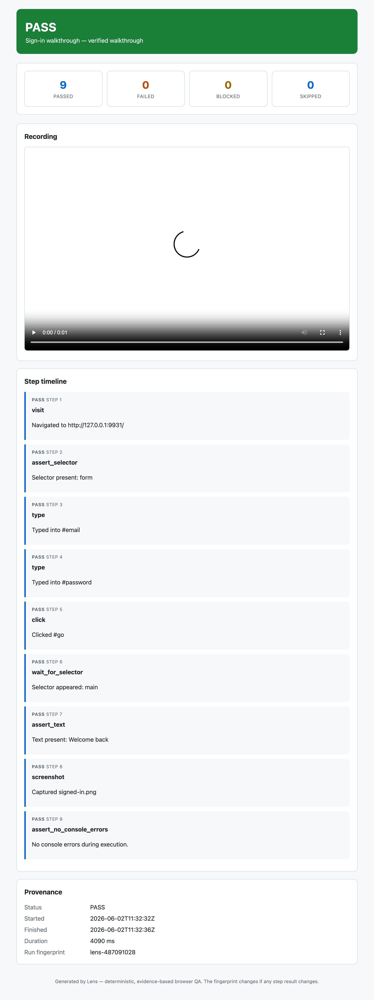
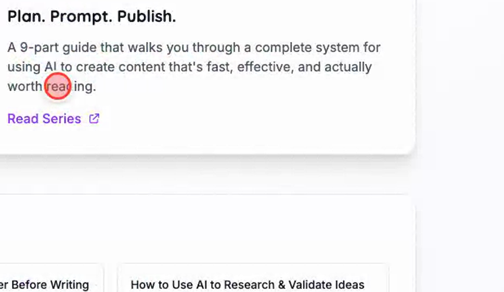

# Lens

[](https://github.com/kujolang/lens/actions/workflows/ci.yml)
[](CHANGELOG.md)
[](tests/lens_tests.kujo)
[](#quick-start)
[](https://github.com/kujolang/kujo)
[](LICENSE)

**Give your AI agents eyes.** Lens opens what you just built in a real browser,
captures what actually renders, and hands back a deterministic, agent-ready
report — no AI, no vision models, no guesswork.

```bash
lens check http://localhost:3000
```
```
Lens completed: PASS
Report: .lens/runs/<timestamp>/lens-report.md
```

That's it. Point Lens at a local dev server and it tells you — with evidence —
whether the page loads, renders, and behaves.

## See it

Lens produces artifacts you can read *and* show. A self-contained HTML report,
and — for executed flows — a `walkthrough.html` that pairs the recording with a
synchronized step timeline and a tamper-evident verdict.

<table>
<tr>
<td width="50%"><a href="docs/assets/report.png"></a><br><sub><b>lens-report.html</b> — verdict, severity counts, screenshots, color-coded findings.</sub></td>
<td width="50%"><a href="docs/assets/walkthrough.png"></a><br><sub><b>walkthrough.html</b> — recording + step timeline + run fingerprint (typed secrets stay redacted).</sub></td>
</tr>
</table>

Executed flows (`lens flow --execute --record`) drive the page for real — and
the recording shows a cursor gliding to each target and clicking it:

<p></p>

## Contents

- [Why Lens](#why-lens) · [Quick start](#quick-start) · [What you can do](#what-you-can-do)
- [What it checks](#what-it-checks) · [How it works](#how-it-works) · [Output](#output)
- [Lens vs. other tools](#lens-vs-other-tools) · [Exit codes](#exit-codes) · [Learn more](#learn-more)

---

## Why Lens

When an agent (or a person) builds a web app, the hard question is *"does it
actually work?"* Lens answers it the same way every time:

- **🎯 Deterministic** — every finding is backed by captured evidence. Same input, same report. No LLM judgment calls.
- **🏠 Local-first** — only `localhost`/`127.0.0.1` by default. External URLs need an explicit `--allow-external`.
- **🤖 Agent-ready** — emits a structured *Agent Repair Brief* and stable JSON (`schema_version: 1`) an agent can act on directly.
- **🔒 Secret-safe** — tokens, JWTs, credentials, and sensitive params are redacted from every artifact *and* report.
- **👀 Observe, don't touch** — opens a URL and watches. It never clicks, types, logs in, or submits forms unless you opt into a safety-gated flow.

## Quick start

```bash
cd /path/to/kujo && cargo build
cd /path/to/lens/bridge && npm install && npx playwright install chromium
cd /path/to/lens
./lens check http://localhost:3000
```

> **Prerequisites:** the [Kujo](https://github.com/kujolang/kujo) runtime, Node.js ≥ 18, and bash.
>
> New to Lens? The [**Getting Started guide**](docs/getting-started.md) walks you
> from a clean machine to your first report and the test suite, step by step.

## What you can do

| Command | What it does |
|---------|--------------|
| `lens check <url>` | Load a URL, capture evidence, run checks, write a report |
| `lens check <url> --check-links` | Also verify same-origin links (opt-in) |
| `lens check <url> --accessibility` | Add automated axe-core accessibility scanning |
| `lens check <url> --spec spec.json` | Verify deterministic browser assertions |
| `lens check <url> --baseline` / `--compare-baseline` | Save / diff visual regression baselines |
| `lens flow flow.json` | Run a safe, declarative browser flow |
| `lens check <url> --json` | Print a machine-readable summary to stdout |

Run `lens --help` for the full flag list.

## What it checks

Every run looks for the failures that break a freshly-built page:

- 🚫 **Page load** failures, navigation errors, and timeouts
- 🐛 **Console errors** and warnings
- 🌐 **Network failures** (4xx / 5xx / dropped requests)
- 📄 **Blank pages** (multi-signal detection)
- ↔️ **Horizontal overflow** that breaks layout
- 🖼️ **Missing screenshots**, plus optional **link**, **accessibility**, and **visual-diff** checks

Findings come with stable IDs (`LENS-CONSOLE-001`), a severity
(`info < warning < error < critical`), and a suggested repair task.

## How it works

```
lens check <url>
   │
   ├─ 1. Validate URL (localhost-safe by default)
   ├─ 2. Drive headless Chromium via a minimal Node/Playwright bridge
   ├─ 3. Capture evidence: screenshots, console, network, DOM
   ├─ 4. Run deterministic checks in pure Kujo
   └─ 5. Write Markdown + JSON reports and an Agent Repair Brief
```

The bridge only does what Kujo can't do natively (drive a browser). Every
decision — checks, findings, redaction, reports — happens in Kujo.

## Output

Each run writes a self-contained directory:

```
.lens/runs/<timestamp>/
├── lens-report.md       # human-readable report
├── lens-report.json     # stable JSON (schema v1)
├── metadata.json        # timing, config, versions
├── console.json         # redacted console messages
├── network.json         # redacted network events
├── dom-summary.json     # element counts & dimensions
└── screenshots/
    ├── desktop.png       # 1440×900
    └── mobile.png        # 390×844
```

Reports are redacted by default. See [Redaction & Privacy](docs/reference.md#redaction--privacy) for what Lens redacts and how to review it.

## Exit codes

| Code | Meaning |
|------|---------|
| `0` | No findings above the `--fail-on` threshold |
| `1` | Findings at or above the threshold |
| `2` | Invalid input (bad URL, blocked external URL) |
| `3` | Browser/provider failure |
| `4` | Artifact-write failure |

## Lens vs. other tools

Lens overlaps with several tools but occupies a deliberately narrow niche:
**deterministic, local-first, agent-ready browser QA with zero AI.**

| | **Lens** | Lighthouse CI | Playwright Test | Percy / Chromatic |
|---|:--:|:--:|:--:|:--:|
| Primary job | Evidence + repair report | Perf/quality scores | Assertion-based E2E tests | Visual snapshot review |
| Deterministic (no LLM) | ✅ | ✅ | ✅ | ✅ |
| Local-first, no account | ✅ | ✅ | ✅ | ❌ (hosted) |
| Zero test code to write | ✅ | ✅ | ❌ (you write specs) | ❌ |
| Agent-ready repair brief + stable JSON | ✅ | ⚠️ partial | ❌ | ❌ |
| Secret redaction across artifacts | ✅ | ❌ | ❌ | ❌ |
| Records a shareable "it passes" walkthrough | ✅ | ❌ | ⚠️ trace viewer | ⚠️ diffs only |
| Accessibility (axe-core) | ✅ | ✅ | ⚠️ via plugin | ❌ |
| Performance metrics | ⚠️ opt-in basics | ✅ (deep) | ❌ | ❌ |

Use Lighthouse for deep perf budgets and Playwright Test for rich assertion
suites. Reach for **Lens** when an agent (or you) just built something and needs
fast, deterministic, evidence-backed answer to *"does it actually work?"* — plus
an artifact to prove it.

## Learn more

New here? Start with the [**Getting Started guide**](docs/getting-started.md) —
install, setup, first run, reading the report, and tests, end to end.

The [**full reference**](docs/reference.md) covers every flag, the JSON schema,
the safety model, Spec/Eval integration, flows, visual regression, and
accessibility in depth.

- [Getting started](docs/getting-started.md)
- [Flow authoring](docs/flow-authoring.md) — task description → flow JSON (with an agent prompt)
- [Examples](examples/) — canonical, copyable `.lens.toml`, flows, and specs
- [Enhancement checklist](docs/enhancements.md) — where Lens is headed next
- [CLI reference](docs/reference.md#cli-command-reference)
- [Safe browser flows](docs/reference.md#safe-browser-flows-phase-8)
- [Visual regression](docs/reference.md#visual-regression-phase-9)
- [Accessibility checks](docs/reference.md#accessibility-checks-phase-10)
- [Redaction & privacy](docs/reference.md#redaction--privacy)

## What Lens is *not*

No AI/LLM analysis. Not a general browser-automation tool. Not a security
scanner. Not a crawler. Not a WCAG-compliance certifier. Lens is deliberately
narrow: deterministic browser QA, done well.

## Tests

```bash
kujo run tests/lens_tests.kujo   # full test suite passes
```

## Project

- [Changelog](CHANGELOG.md)
- [Contributing](CONTRIBUTING.md) — the build + verification gauntlet
- [Enhancement checklist](docs/enhancements.md) — the roadmap, task by task

## License

MIT © Robert DeVore — see [LICENSE](LICENSE).
